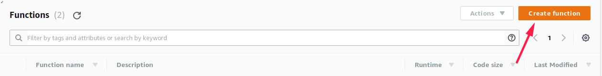
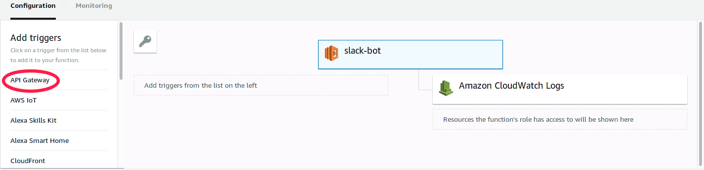
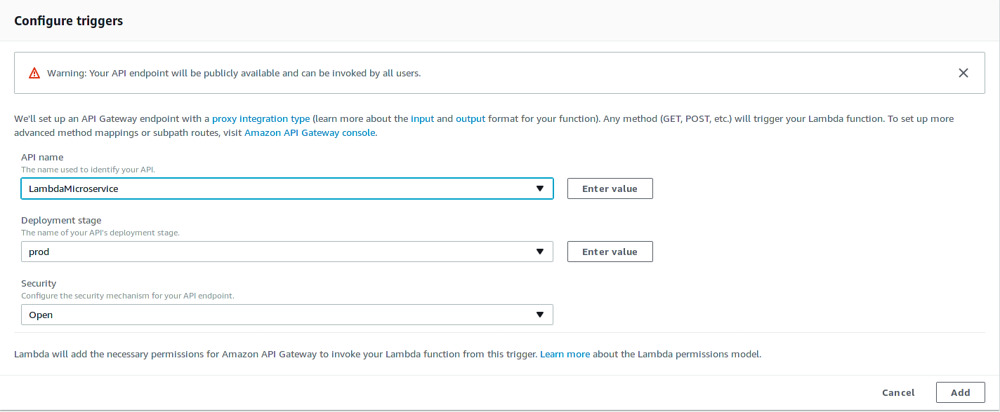
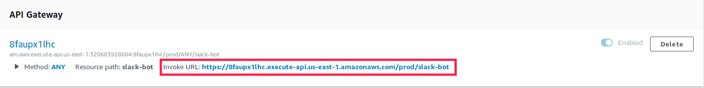
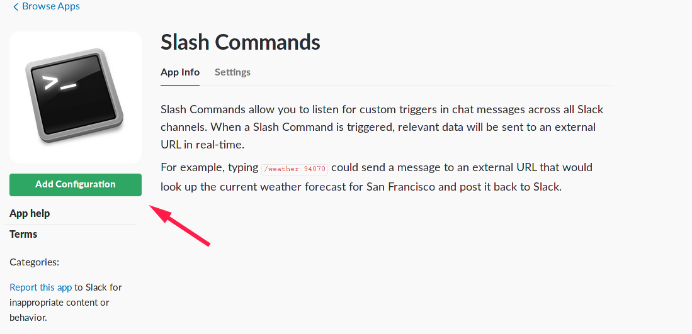
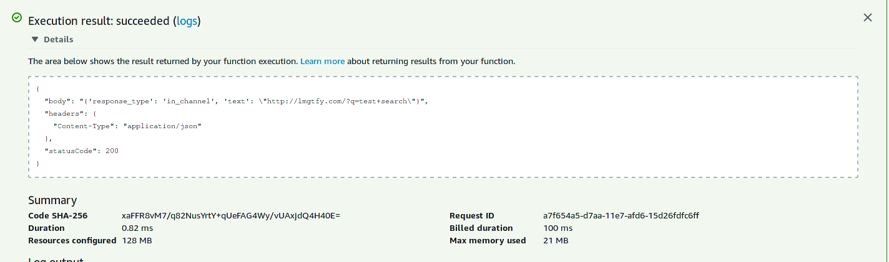
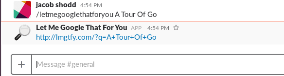

[See the latest code here](https://www.github.com/jshodd/goBot)

## The Problem

I am in a number of slack groups and all seem to have their own workarounds to providing new users with information about the organization. Some use the built in SlackBot and it's custom responses, some use pre-built plugins that loosly meet their needs, and some build their own plugins based on what they need. For smaller organizations hosting a server to run a slackbot 24/7 is quite unreasonable, especially when the application is simply providing users with information such as rules, learning resources etc. My goal for this project was to create a fast, lightweight, and cost effective slackBot solution.

##  Overview

There are various ways to imlement a slackbot, but it basically boils down to two types. Your bot can listen through an api for slack to call it by a user typing in a slash command such as `/infobot learn` or your bot can constantly poll slack though the slack api for specific events, such as a new user joining or a specific word used. Keeping cost in mind I went with the first option, because the application only has run when it's called. So what are our options as far as hosting goes? Well we could set up out own physical server to host this application and build a rest API on top of it, or use something like an amazon EC2 instance to avoid using physical hardware. Now this would work, but it goes two of our goals: being lightweight and being cost effective. For a simple slash command that is just going to return a generated link or list of learning resources, an entire dedicated server is quite overkill and the cost of hosting that server will add up. This is where AWS Lambda comes in. Lambda will only run your code when it is triggered by a defined event, so you don't pay for the time your code isn't run. More importantly, you get your first **1,000,000** requests free, which far exceeds what nearly any slack command will use. You can use a number of different events, but for this project we use Amazon's API gateway. We will get more into configuring lambda later in this post, but lets just get an overview of what will happen when a slack command is called:

1. A user types a command like `/infobot learn`
* Slack sends a POST or GET request to a url specified when setting up the slack command
* Amazon's API Gateway recieves the request
* API Gateway triggers the Lambda function and passes the request information as an argument
* Our application runs and returns a json object
* Lambda and API Gateway sends the json object to slack
* Slack uses the data stored in the json object to post your bot's output

## Setting Up AWS

This post doesn't go into the details of setting up your AWS account, so it is assumed that you have an account created already. In your management console, go to Lambda and create a new function. 



After this we need to set some basic configuration options for our function. As of right now Go isn't officially supported, so we will be using a shim (We'll get to that part in a moment) and that calls for a Python 2.7 runtime. After naming your function, you need to apply an appropriate role to it. In this example I am creating a new role with some basic Lambda Permissions.


Awesome, we have a function (that doesn't do anything)! If you are using Python, C#, Java, or Node.js you can start writing your application in the browser's code editor, but I wanted to be stubborn and use golang so we will get into that process in the next section. Before we get to the code, let's take care of how exactly slack and our function are going to talk. Now the interface for AWS changes quite rapidly, so if your screen doesn't quite look like mine, don't panic. Look for where you can add triggers and select `API Gateway`.



This will bring up a page for you to configure your brand new api, but for the sake of simplicity we will not go into how to fully configure your api. By default, Amazon will create an API for you that will accept any method, and all of the data will be passed to your lambda function. So you can either go into API Gateway and specify a specific method that you would like to use (Slack supports POST and GET requests) or you can manually check the method in your function if needed. To get your API up and running you simply need to select a name for the api, deployment stage, and security setting. For the deployment stage you can leave it as prod, as we will not be making any changes to the configuration, and for the security setting you must mark it as open.



After applying those settings and saving your function with the button in the top left of the screen, you are ready to use your api. After saving you can go to your triggers and you should see your API there with some information, including the invoke url. Make sure to copy this url, as we will need it in the next step to set up slack. (Don't worry, by the time you read this the invoke url below will no longer be in use)



## Setting up Slack

For this you will either need to own or have some admin rights for a Slack workspace. You then want to go to "Manage Apps" and add the "Slash Commands". After slash commands has been added you your slack, you want to add a configuration.



You then choose a slash command you create, for this example I am making `/letmegooglethatforyou` command that will generate a link like this: http://lmgtfy.com/?q=Jacob+Shodd. After choosing the name for your command you need to provide a url to slack, this is the invoke url of our api gateway. After this there are various other configurations you can make such as a description, autocomplete, etc. 


Great, we have an API, a slash command, and a lambda function! let's try this bad boy out!


Drats! It looks like our slack command isn't working, but that's probably because our lambda function doesn't have any code to run, but who knew? Now I didn't include that just to take up space, as that is the only error info that slack will give you. Not very descriptive is it? It took a *long* time to figure out the format that slack wanted for the returned info, but error messages from slack were no help. In the next section when we talk about code we will see how you can emulate a slack request and be able to see just how your function is returning the data, as it can get a little freaky with go.

## Did Somebody Say Code?

Finally, the heart of the project! For the sake of this article I'm just going to go into how to receive data from slack, and how to return it. This will be easy because our example is only generating a url, a one line operation. The current code for my slack command can be found [here](https://github.com/jshodd/goBot) and may look quite different than what we will get into here, but the logic will still be the same. 

1. Break down the input
* Process the data 
* Structure the response 
* Return the data

So lets get into how we set this project up. We will be using the [aws-lambda-go-shim](https://github.com/eawsy/aws-lambda-go-shim) for this project and in order to use you will need to do a few things, so go to your project directory and run:

```bash
# Pull the docker image used to build the program, install docker if needed
$ docker pull eawsy/aws-lambda-go-shim:latest
# Pull the go files from github
$ go get github.com/eawsy/aws-lambda-go-core/...
# Download the Makefile used to build your program
$ wget -O Makefile https://git.io/vytH8
```

With this we are now ready to start building our application. We'll start with the most important component we need to work with lambda. In your main function, Lambda expects there to be a `Handle` function as described below, without this, your Lambda will throw an error. You can think of this as your main function for this project.

```golang
package main

import (
  "encoding/json"

  "github.com/eawsy/aws-lambda-go-core/service/lambda/runtime"
)

func Handle(evt json.RawMessage, ctx *runtime.Context) (interface{}, error) {
  // ...
}
```

The `evt` that is passed into your function is the entire request sent from Slack, including all headers and information about the request as well as the information from Slack. The second parameter `ctx` contains some useful information about Lambda, such as how much longer your application has to run (Lambda limits your application to 5 Minutes of uptime). For this example we won't be needing `ctx`, but we will be using `evt` to extract more information about the command that was passed. It is quite ugly, but this is an example of what is contained in `evt`

```json
{
  "body": "token=WwnfYJCqdAtEg722m8neeWQU&team_id=T86U125SM&team_domain=nsfplayground&channel_id=C88A25PQE&channel_name=general&user_id=U86PW6STS&user_name=jacobshodd&command=%2Fletmegooglethatforyou&text=test+search&response_url=https%3A%2F%2Fhooks.slack.com%2Fcommands%2FT86U125SM%2F280668852308%2F8mxhR2TgMLp3UnSItgQXNB64",
  "resource": "/{proxy+}",
  "requestContext": {
    "resourceId": "123456",
    "apiId": "1234567890",
    "resourcePath": "/{proxy+}",
    "httpMethod": "POST",
    "requestId": "c6af9ac6-7b61-11e6-9a41-93e8deadbeef",
    "accountId": "123456789012",
    "identity": {
      "apiKey": null,
      "userArn": null,
      "cognitoAuthenticationType": null,
      "caller": null,
      "userAgent": "Custom User Agent String",
      "user": null,
      "cognitoIdentityPoolId": null,
      "cognitoIdentityId": null,
      "cognitoAuthenticationProvider": null,
      "sourceIp": "127.0.0.1",
      "accountId": null
    },
    "stage": "prod"
  },
  "queryStringParameters": {
    "foo": "bar"
  },
  "headers": {
    "Via": "1.1 08f323deadbeefa7af34d5feb414ce27.cloudfront.net (CloudFront)",
    "Accept-Language": "en-US,en;q=0.8",
    "CloudFront-Is-Desktop-Viewer": "true",
    "CloudFront-Is-SmartTV-Viewer": "false",
    "CloudFront-Is-Mobile-Viewer": "false",
    "X-Forwarded-For": "127.0.0.1, 127.0.0.2",
    "CloudFront-Viewer-Country": "US",
    "Accept": "text/html,application/xhtml+xml,application/xml;q=0.9,image/webp,*/*;q=0.8",
    "Upgrade-Insecure-Requests": "1",
    "X-Forwarded-Port": "443",
    "Host": "1234567890.execute-api.us-east-1.amazonaws.com",
    "X-Forwarded-Proto": "https",
    "X-Amz-Cf-Id": "cDehVQoZnx43VYQb9j2-nvCh-9z396Uhbp027Y2JvkCPNLmGJHqlaA==",
    "CloudFront-Is-Tablet-Viewer": "false",
    "Cache-Control": "max-age=0",
    "User-Agent": "Custom User Agent String",
    "CloudFront-Forwarded-Proto": "https",
    "Accept-Encoding": "gzip, deflate, sdch"
  },
  "pathParameters": {
    "proxy": "path/to/resource"
  },
  "httpMethod": "POST",
  "stageVariables": {
    "baz": "qux"
  },
  "path": "/path/to/resource"
}
```

As you can see there is quite a lot of data in there, but we really only need the body. To make it easier to work with this data I made a struct to unpack the json into called Request.

```go
//Type Request
type Request struct {
	Resource              string            `json:"resource"`
	Path                  string            `json:"path"`
	HttpMethod            string            `json:"httpMethod"`
	Headers               map[string]string `json:"headers"`
	QueryStringParameters string            `json:"queryStringParameters"`
	PathParameters        string            `json:"pathParameters"`
	StageVariables        string            `json:"stageVariables"`
	RequestContext        map[string]string `json:"requestContext"`
	Body                  string            `json:"body"`
	IsBase64Encoded       string            `json:"isBase64Encoded"`
}
```

This allows us to create a Request object and then use `json.Unmarshal` to unpack `evt` into this object. like so:

```go
var request Request
json.Unmarshal(evt, &request)
```

Now that we can easilly access the information in the body by calling `request.Body` we can get going right? Well, not quite yet. Even though the body is sent as a string, it actually holds a lot of information, and thus I gave it it's own struct, and a fucction to parse the url encoded string that is sent by slack.

```go
type SlackInfo struct {
	TeamId      string `json:"team_id"`
	TeamDomain  string `json:"team_domain"`
	ChannelId   string `json:"channel_id"`
	UserId      string `json:"user_id"`
	UserName    string `json:"user_name"`
	Command     string `json:"command"`
	ResponseUrl string `json:"response_url"`
	Token       string `json:"token"`
	ChannelName string `json:"channel_name"`
	Text        string `json:"text"`
}

func toInfo(input string) SlackInfo {
	data, _ := url.ParseQuery(input)
	result := SlackInfo{
		TeamId:      data["team_id"][0],
		TeamDomain:  data["team_domain"][0],
		ChannelId:   data["channel_id"][0],
		UserId:      data["user_id"][0],
		UserName:    data["user_name"][0],
		Command:     data["command"][0],
		ResponseUrl: data["response_url"][0],
		Token:       data["token"][0],
		ChannelName: data["channel_name"][0],
		Text:        data["text"][0]}
	return result
}
```

This lets us directly access the information sent by slack by simply doing `info := toInfo(request.Body)`. So now that we have the request data structured in a way that it is all easily accessible, we will need to do the same for the response data. This is where most of my issues came from. Slack expects a json object with three fields:

1. statusCode
* body
* headers

Within the Body field there are two sub field: `response_type` and `text`. the response type field lets you choose if everybody in the slack will see the message or only the one who calls the command. This is decided by using `in_channel` for a public message or `ephemeral` for a private message. The `text` field will contain your message to be displayed, which can also use any of slack's formatting tools. This is all quite easy to understand, but for some reason it also expects the body to be a string, with the `text` field in the body using escaped double quotes, or text formatting in slack don't work. This was a massive pain in the neck to figure out, but I ultimately used the following structs and function to make returning data to slack easy for me:

```go
type Response struct {
	StatusCode int               `json:"statusCode"`
	Body       string            `json:"body"`
	Headers    map[string]string `json:"headers"`
}

func NewResponse(statusCode int, responseType, text string) Response {
	headers := map[string]string{"Content-Type": "application/json"}
	message := Message{ResponseType: responseType, Text: text}
	return Response{StatusCode: statusCode, Body: message.String(), Headers: headers}
}

type Message struct {
	ResponseType string `json:"response_type"`
	Text         string `json:"text"`
}

func (this *Message) String() string {
	return fmt.Sprintf("{'response_type': '%s', 'text': \"%s\"}", this.ResponseType, this.Text)
}
```

Now I realize that is a lot of code just to handle input and output of the function, but the bright side is that now don't have to worry it, and life gets much easier. So to finish this section up, this is what our final `Handle` function would look like for this aplication:

```go
func Handle(evt json.RawMessage, ctx *runtime.Context) (interface{}, error) {
	var request Request
	json.Unmarshal(evt, &request)
	info := toInfo(request.Body)
	text := "http://lmgtfy.com/?q=" + strings.Replace(info.Text, " ", "+", -1)
	return NewResponse(200, "in_channel", text), nil
}
```
This takes the text from the slack request (the text that comes after the command), replaces all spaces in the string, and appends it to `http://lmgtfy.com/?q=` to create our url. This is then used to create or response and it is sent back to slack! Notice that we did not marshal our request into a json object, this is one feature of the shim is that it will automatically marshal whatever struct that you return. So now for the easy part, getting the code on Lambda. As of now Go isn't officially supported, so we will be using the tools that we downloaded earlier, but sometime in early 2018 these last steps will not be needed, as Amazon announced official support for Go on Lambda. All that is needed is to run `make` in our project directory and the shim takes care of everything and outputs a zip file.


## Uploading Go Code to Lambda And Testing

So our code is done and we're ready to rock and roll. Go to the Lambda dashboard for your function enter the settings as you see below. We need Amazon to look for our function, so we set our handler to "handler.Handle" and we select "Upload a .ZIP file"


After clicking upload and saving your function you should be ready to go! But before we try out command, lets look at how we can test to trouble shoot issues. In the top left corner there is a drop down for tests, click that and select "configure test events" and a window with a text editor will come up. This allows you to create an object that will be passed to your function, and will print out what your function returns, what slack will receive. In this window you can paste in the full request that I included above, but I will provide it again here:

```json
{
  "body": "token=WwnfYJCqdAtEg722m8neeWQU&team_id=T86U125SM&team_domain=nsfplayground&channel_id=C88A25PQE&channel_name=general&user_id=U86PW6STS&user_name=jacobshodd&command=%2Fletmegooglethatforyou&text=test+search&response_url=https%3A%2F%2Fhooks.slack.com%2Fcommands%2FT86U125SM%2F280668852308%2F8mxhR2TgMLp3UnSItgQXNB64",
  "resource": "/{proxy+}",
  "requestContext": {
    "resourceId": "123456",
    "apiId": "1234567890",
    "resourcePath": "/{proxy+}",
    "httpMethod": "POST",
    "requestId": "c6af9ac6-7b61-11e6-9a41-93e8deadbeef",
    "accountId": "123456789012",
    "identity": {
      "apiKey": null,
      "userArn": null,
      "cognitoAuthenticationType": null,
      "caller": null,
      "userAgent": "Custom User Agent String",
      "user": null,
      "cognitoIdentityPoolId": null,
      "cognitoIdentityId": null,
      "cognitoAuthenticationProvider": null,
      "sourceIp": "127.0.0.1",
      "accountId": null
    },
    "stage": "prod"
  },
  "queryStringParameters": {
    "foo": "bar"
  },
  "headers": {
    "Via": "1.1 08f323deadbeefa7af34d5feb414ce27.cloudfront.net (CloudFront)",
    "Accept-Language": "en-US,en;q=0.8",
    "CloudFront-Is-Desktop-Viewer": "true",
    "CloudFront-Is-SmartTV-Viewer": "false",
    "CloudFront-Is-Mobile-Viewer": "false",
    "X-Forwarded-For": "127.0.0.1, 127.0.0.2",
    "CloudFront-Viewer-Country": "US",
    "Accept": "text/html,application/xhtml+xml,application/xml;q=0.9,image/webp,*/*;q=0.8",
    "Upgrade-Insecure-Requests": "1",
    "X-Forwarded-Port": "443",
    "Host": "1234567890.execute-api.us-east-1.amazonaws.com",
    "X-Forwarded-Proto": "https",
    "X-Amz-Cf-Id": "cDehVQoZnx43VYQb9j2-nvCh-9z396Uhbp027Y2JvkCPNLmGJHqlaA==",
    "CloudFront-Is-Tablet-Viewer": "false",
    "Cache-Control": "max-age=0",
    "User-Agent": "Custom User Agent String",
    "CloudFront-Forwarded-Proto": "https",
    "Accept-Encoding": "gzip, deflate, sdch"
  },
  "pathParameters": {
    "proxy": "path/to/resource"
  },
  "httpMethod": "POST",
  "stageVariables": {
    "baz": "qux"
  },
  "path": "/path/to/resource"
}
```

This is the equivalent of somebody typing `/letmegooglethatforyou test search` in you slack channel. After saving this, click the test button next to the drop down and you will be given your test feedback including what was returned by your function:



Our output looks great, now for the ultimate test, what happens when we run `/letmegooglethatforyou A Tour Of Go`?



And that's it! Congrats, you now have a basic slash command up and running. Now you can use this example to create some commands that have some more functionality without having to worry about how your data gets to and from slack. And the best part? You will most likely never have to pay for this service, unless you see your command being used over 1,000,000 times a month that is. 
