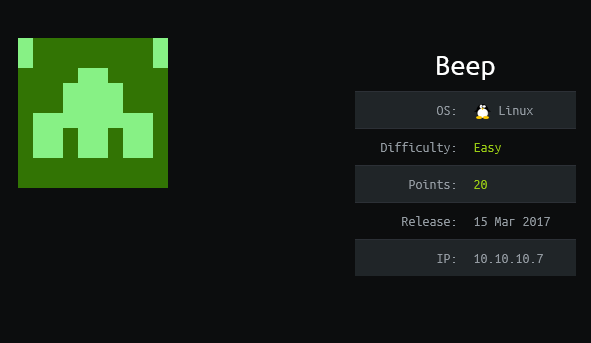
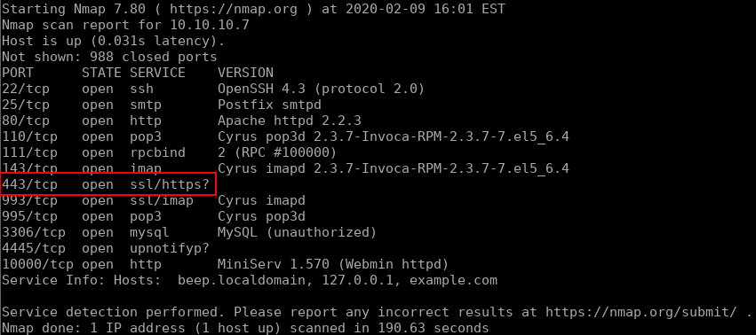
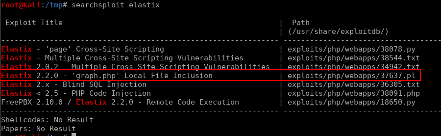
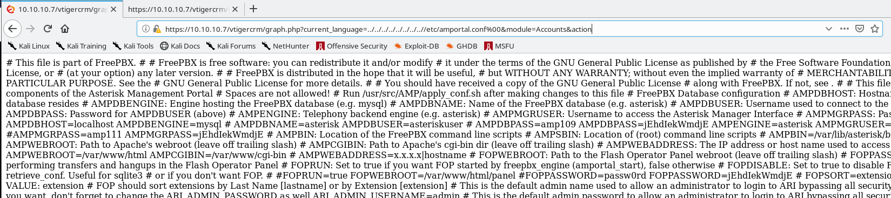
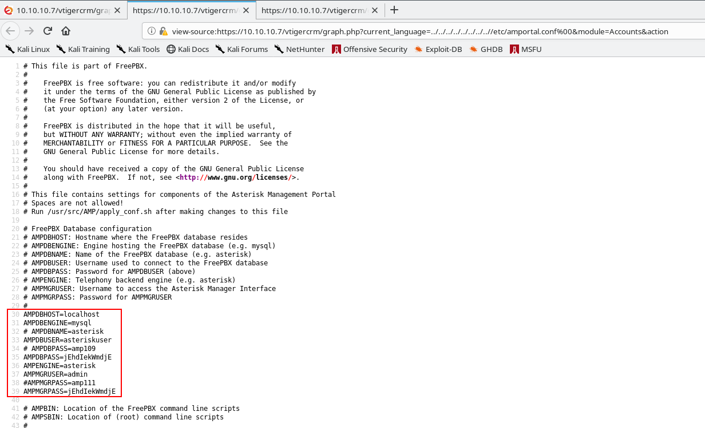
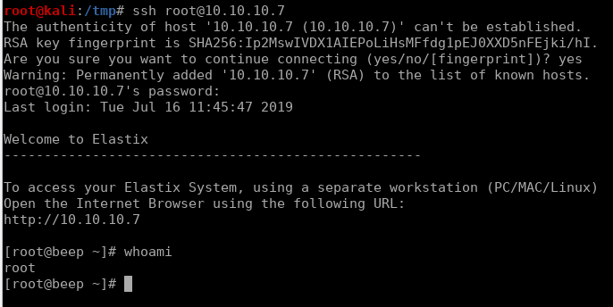
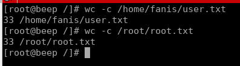

# Beep


## Initial Enumeration

First we'll start off with a simple nmap scan to see what we have to work with:

```bash
nmap -sV 10.10.10.7 
```



So there is a **lot** of output here, which is most likely there to send you down rabbit holes. Just slowly go through each result and take a quick peak and move on to the next one. It can be really easy to dive too deep into the wrong solution, so try to keep that in mind here. As we progress through all of the open ports we get to `80` (which redirects to `443`) and see a login page for Elastix:


As usually, we try some default credentials that we find from a google search (`admin:admin`,`admin:mypassword`,`admin:palosanto`,etc), but we turn up empty. Our next step is looking for exploits. using searchsploit we find this [exploit](https://www.exploit-db.com/exploits/37637):



Looking through the exploit we see that in the `2.2.0` version of Elastix there is an LFI vulnerability. 

## Exploitation

The code provided with the exploit goes to a known file location for this service, which also happens to store the admin password in plain text. Instead of using the perl exploit to perform a `GET` request, we can simply navigate to the url that it builds:

```
https://10.10.10.7/vtigercrm/graph.php?current_language=../../../../../../../..//etc/amportal.conf%00&module=Accounts&action
```

This gives us some less than readable information:



But we can clean this up by viewing the source of the page (`CTRL+U` in firefox):



We can clearly see that the credentials we need are `admin:jEhdIekWmdjE` and we are able to log into the Elastix console. While there were also some authenticated RCE vulnerabilities in our searchsploit results, lets try the easiest option first and attempt to ssh to the box as root with the same password:



The lazy sysadmin strikes again! With this we are able to read both flags:


